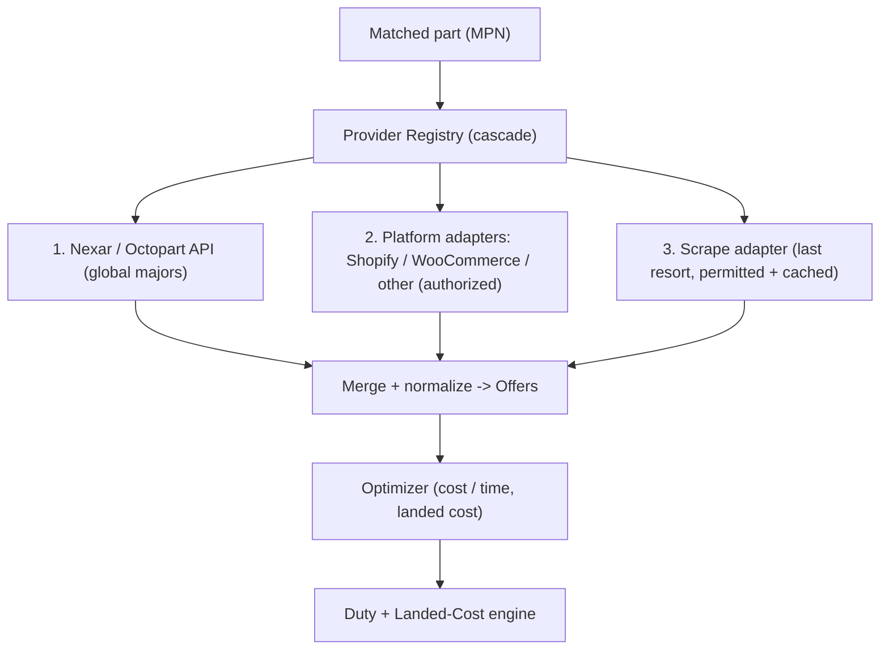
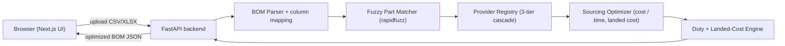

# RFQ-AI: AI BOM Sourcing Platform

## What it does
A hardware engineer or company uploads a PCB BOM (CSV/Excel). The platform:
1. Parses the file and normalizes columns.
2. Fuzzy-matches messy/partial part entries to real manufacturer part numbers (MPNs).
3. Searches all available suppliers globally.
4. Returns an optimized sourced BOM - cost-optimized or time-optimized - with true landed cost (unit price + shipping + import duty), lead times, alternates, and a match-confidence score.

India-first: prices shown in INR by default, India is the default destination, and the engine surfaces the "buy local (no import duty) vs import cheaper (plus duty)" trade-off.

## Finalized decisions
- Scope: working MVP with a fully real engine (parse, match, optimize, duty). Distributor data is mocked behind the same adapter interface the real sources use, so real providers swap in without touching the engine.
- Stack: Next.js (App Router, TypeScript) + Tailwind frontend; Python FastAPI + Pydantic backend.
- The "AI": deterministic algorithms (fuzzy matching + optimization + duty). Accurate, repeatable, auditable - no LLM guessing on prices.
- Market: India-first (INR default, India default destination, domestic offers = zero import duty).
- Data policy: DATA-ONLY. Feeds/APIs used purely for sourcing data. No affiliate/buy-links, no commission-biased ranking. Neutral results.
- No auth/DB/payments in the MVP.

## Data-sourcing strategy (finalized 3-tier cascade)
For each matched part, the Provider Registry queries sources in priority order and merges all offers it gets back:

1. Nexar / Octopart API (PRIMARY) - one API aggregating global distributors (Digi-Key, Mouser, Arrow, Farnell, LCSC, etc.). Real-time price, stock, lead time. Requires Nexar API credentials.
2. Platform adapters (REGIONAL / India) - reusable providers that pull from distributors running on standard e-commerce platforms, using authorized API credentials the distributor issues:
   - Shopify adapter - Admin API (real-time inventory) or Storefront API token. (e.g. Robocraze.)
   - WooCommerce adapter - REST API consumer key/secret (`/wp-json/wc/v3/products`: price, stock_quantity, stock_status).
   - Other platforms (Magento, etc.) - added as needed. One reusable provider per platform serves many distributors via per-store config (base URL + credentials).
3. Scraping adapter (LAST RESORT) - only used when tiers 1 and 2 return nothing for a part, and only for sources where it is permitted. Reads structured data (Shopify `products.json`, `schema.org` JSON-LD) behind a cache with TTL and rate-limiting. Off by default; enabled per-source. Never in the fast path when an API/feed exists.

## Architecture (request flow)

## Backend layout (`backend/`)
- `app/main.py` - FastAPI app, CORS, router registration.
- `app/routers/bom.py` - `POST /bom/parse` (upload -> normalized lines + suggested column mapping); `POST /bom/source` (lines + destination country + objective -> `SourcingResult`).
- `app/models.py` - Pydantic models:
  - `Offer` - distributor, `access_method` (official_api | shopify | woocommerce | manual_upload | scrape), `authorized: bool`, currency, region/warehouse country, `country_of_origin`, price-break tiers, stock, `lead_time_days`, MOQ, packaging, `hs_code`, product URL.
  - `BomLine`, `SourcedLine` (chosen offer + alternates + match confidence), `DutyBreakdown`, `SourcingResult` (lines + summary totals).
- `app/services/parser.py` - read CSV/XLSX (pandas/openpyxl); auto-detect columns (MPN, manufacturer, qty, refdes, description) via header heuristics + fuzzy header matching.
- `app/services/matcher.py` - normalize input MPN/description; rapidfuzz match to catalog; return best match + ranked alternates + confidence; flag low-confidence lines.
- `app/services/fx.py` - fixed-rate currency table; normalize all offers to INR for comparison/display.
- `app/services/catalog/base.py` - `CatalogProvider` interface (`search(mpn, description) -> list[Offer]`) with `access_method`/`authorized` contract.
- `app/services/catalog/registry.py` - runs the 3-tier cascade, drops unauthorized `scrape` offers, merges + de-dupes offers.
- `app/services/catalog/mock_provider.py` - MVP default; reads `app/data/mock_catalog.json`.
- `app/services/catalog/nexar_provider.py` - real Nexar/Octopart adapter (stub in MVP, activated with API credentials).
- `app/services/catalog/shopify_provider.py`, `woocommerce_provider.py` - reusable platform adapters (stubs in MVP; per-store config).
- `app/services/catalog/scrape_provider.py` - last-resort adapter (disabled by default).
- `app/services/optimizer.py` - per line + qty: aggregate authorized offers, honor price breaks/MOQ/stock, compute landed cost; `cost` = minimize total landed cost; `time` = minimize max lead time then landed cost. Neutral ranking.
- `app/services/duty.py` - `app/data/duty_table.json` keyed by (destination country, HS chapter) -> duty rate; duty = rate x customs value + shipping estimate; landed = line cost + shipping + duty; domestic (origin == destination) => zero import duty.
- `app/data/mock_catalog.json` - mixed-source seed parts (resistors, caps, MCUs, connectors, ICs): offers from global API distributors (USD, imported) AND Indian platform distributors (INR, local stock, domestic origin).
- `requirements.txt` (fastapi, uvicorn, pydantic, pandas, openpyxl, rapidfuzz, python-multipart, httpx), `README.md`.

## Frontend layout (`frontend/`)
- Next.js App Router + Tailwind:
  - `/` - landing: B2B/B2C value prop, CTA to upload.
  - `/upload` - drag-drop CSV/XLSX -> `/bom/parse`; editable column mapping; destination-country selector (default India); objective toggle (Cost / Time); sample-BOM download.
  - `/results` - optimized BOM table: chosen supplier with source-type badge (API / Platform / Local), unit price, qty, lead time, duty, landed cost, match-confidence badge, expandable alternates (local vs imported); summary cards (total landed cost, max lead time, total duty, local-vs-imported split, line coverage %); toggle re-runs optimization. INR by default.
- `lib/api.ts` - typed fetch client; loading/error states throughout.

## Build order
1. Backend scaffold (FastAPI, CORS, routers, requirements, README).
2. Pydantic models (incl. `Offer` with `access_method`/`authorized`).
3. Mixed-source mock catalog + `CatalogProvider` interface + registry cascade + mock provider.
4. BOM parser (CSV/XLSX auto column detection).
5. Fuzzy matcher (rapidfuzz + confidence + alternates).
6. Currency (fixed-rate -> INR).
7. Optimizer (cost + time objectives on landed cost).
8. Duty engine (per destination/HS/origin; domestic zero).
9. API routes (`/bom/parse`, `/bom/source`).
10. Provider adapter stubs (Nexar, Shopify, WooCommerce, scrape) implementing the interface.
11. Frontend scaffold (Next.js + Tailwind + API client).
12. Upload UI (drag-drop, mapping, destination, objective).
13. Results dashboard (table, badges, alternates, summary cards).
14. sample_bom.csv + README run instructions.

## How to run (after build)
- Backend: `uvicorn app.main:app --reload` (port 8000).
- Frontend: `npm run dev` (port 3000).
- Test with the included `sample_bom.csv`.

## Real-data activation (post-MVP)
- Nexar/Octopart: add API credentials -> `nexar_provider` becomes primary source.
- Regional distributors: ask each for Shopify (custom app token) or WooCommerce (REST consumer key/secret) credentials -> configure the reusable platform adapter. This is a ~5-minute task on the distributor's side.
- Scraping: enable per-source only where permitted, as the last-resort fallback, cached with TTL.

## Out of scope (MVP)
- Live real provider credentials (adapters are stubbed/ready), user auth, payments/RFQ ordering, persistent DB, affiliate monetization, live FX rates (fixed), legally-binding tariff data (representative duty table).
